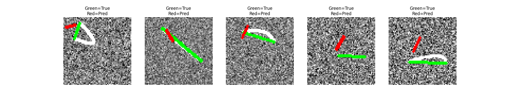

# Script to generate a professional README.md for SAR-Net Missile Detection
readme_text = """# Missile Streak Detection and Localization System Using SAR-Net

[cite_start]This project addresses the critical challenge of real-time detection and localization of ballistic missiles using optical sensors[cite: 3]. [cite_start]The system identifies dim, short-lived missile streaks within images distorted by atmospheric interference, Poisson sensor noise, and background clutter[cite: 4, 5].

---

## 🚀 Key Features
* [cite_start]**Deep Learning Approach**: Utilizes **SAR-Net (Spatial Attention Residual Network)** to learn patterns directly from data rather than relying on hand-crafted statistics[cite: 8, 9].
* [cite_start]**Denoising & Detection**: Integrates spatial attention to enhance "streak" regions and suppress irrelevant background noise in a single unified step[cite: 96, 122].
* [cite_start]**Realistic Flight Modeling**: Trained on **Bezier curves** to capture curved flight paths influenced by gravity and air resistance[cite: 17, 83].
* [cite_start]**High-Speed Inference**: Optimized for millisecond-level processing (< 10 ms per prediction) on limited-power hardware[cite: 25, 150].

---

## 🏗️ System Architecture
[cite_start]The SAR-Net model consists of three primary components designed for low-SNR environments[cite: 87, 89]:

| Component | Description |
| :--- | :--- |
| **Residual Feature Extraction** | [cite_start]Uses skip connections to keep weak signals visible across deep layers[cite: 91]. |
| **Spatial Attention Module (SAM)** | [cite_start]Dynamically adjusts pixel weights to boost streak signals and reduce interference[cite: 94, 96]. |
| **Dual-Head Prediction** | [cite_start]Features a **Classification Head** (threat detection) and a **Regression Head** (path coordinate prediction)[cite: 100, 101]. |

---

## 📊 Performance and Evaluation
[cite_start]The system is trained over **20 epochs** using the **Adam optimizer** with a multi-objective loss function (Binary Cross-Entropy and Mean Squared Error)[cite: 18, 113, 115].

### Training Results
[cite_start]The model demonstrates rapid convergence in detection accuracy and total loss reduction[cite: 132].

> [cite_start]**Figure 1**: Training metrics showing convergence of Detection Accuracy and Total Loss[cite: 132].

### Visual Ground Truth Verification
[cite_start]The model accurately targets the streak pattern despite heavy noise distortions[cite: 135].

> [cite_start]**Figure 2**: Visual evaluation showing the predicted path (Red) vs. actual Ground Truth (Green)[cite: 136].

---

## 🧪 Experiments and Documentation
This section contains detailed experimental reports. **[Add your .doc report files here]**

### Experiment 1: Comparative Analysis (SAR-Net vs. GLRT)
[cite_start]A Monte Carlo simulation comparing SAR-Net against the traditional Generalized Likelihood Ratio Test across noise levels from 2 dB to 15 dB[cite: 161, 165].
> **[INSERT EXPERIMENT 1 REPORT (.DOC) HERE]**

---

### Experiment 2: Ablation Study of Spatial Attention
[cite_start]Evaluating the performance contribution of the Spatial Attention Module by comparing it against a baseline ResNet structure[cite: 151, 152].
> **[INSERT EXPERIMENT 2 REPORT (.DOC) HERE]**

---

### Experiment 3: Non-Linear Trajectory Regression
[cite_start]Analysis of the system's ability to estimate curved motion paths compared to simplified linear models[cite: 124, 126].
> **[INSERT EXPERIMENT 3 REPORT (.DOC) HERE]**

---

## 🛠️ Environment & Tools
* [cite_start]**Language**: Python 3.10 [cite: 144]
* [cite_start]**Framework**: TensorFlow 2.x with Keras [cite: 144]
* [cite_start]**Simulation**: OpenCV for physics-based path and noise rendering [cite: 145]
* [cite_start]**Hardware**: Recommended NVIDIA GPU (T4/RTX) for millisecond latency [cite: 148, 150]

---

## 📚 Core References
* [cite_start][1] H. E. Balci and A. M. Tekalp, "Machine learning for missile streak detection and localization," IEEE ICIP, 2021[cite: 259].
* [cite_start][2] J. Virtanen et al., "Deep learning for space debris streak detection in optical images," AMOS, 2019[cite: 260].
* [cite_start][3] T. Zhang et al., "Attention-guided pyramid context networks for infrared small target detection," IEEE TAES, 2021[cite: 261, 262].
"""

with open("README.md", "w", encoding="utf-8") as f:
    f.write(readme_text)

print("README.md successfully created!")
